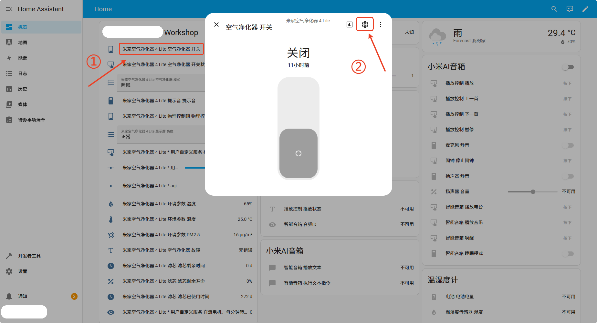

# 0. Home Assistant 简介
Home Assistant 是一个开源的智能家居平台，旨在将各类设备、服务和应用集成到一个统一的控制系统中。它支持本地化运行，注重隐私和安全，允许用户通过自动化、脚本和仪表盘灵活管理家居设备。其核心优势在于高度的可定制性和广泛的兼容性，能够连接数千种品牌和协议，打破生态壁垒。用户可以通过直观的界面或代码级配置实现复杂场景，同时社区生态提供了丰富的插件与扩展。无论是初学者还是开发者，都能找到适合的使用方式。

# 1. 部署Home Assistant
Home Assistant 提供了多种官方支持的部署方式，以适应不同用户的需求和设备环境。以下是主要的几种部署方式：
### 1) Home Assistant OS（HAOS）
 - 这是最完整的部署方式，专为 Home Assistant 设计的轻量级操作系统，基于 Linux，并预装了 Supervisor（用于管理插件和更新）。
 - 适用于 Raspberry Pi、虚拟机（如 Proxmox、VMware、VirtualBox）或专用硬件（如 ODROID、Intel NUC）。
 - 提供最佳的兼容性和易用性，适合新手和希望获得完整功能的用户。

### 2） Docker 容器
 - 官方提供 Docker 镜像（homeassistant/home-assistant），可在支持 Docker 的环境中运行，如 Linux、Windows（通过 Docker Desktop）、NAS 等。
 - 适用于熟悉 Docker 的用户，灵活性高，但需要手动管理依赖项（如数据库、MQTT 服务等）。

### 3) Linux 原生安装（Python 虚拟环境）
 - 适用于 Linux 服务器（如 Ubuntu、Debian），通过 Python 虚拟环境运行，适合高级用户。
 - 需要手动安装依赖项，但可以更精细地控制系统资源。

### 4) Windows 子系统 Linux（WSL）
 - 可在 Windows 10/11 的 WSL（如 Ubuntu）中运行 Home Assistant，但官方不推荐长期使用，仅适用于测试。
 - 性能可能受限，且需要额外配置网络访问。

**更多详细部署指南，可参考 Home Assistant [官方安装文档。](https://www.home-assistant.io)**

# 2. 添加集成设备
Home Assistant 添加设备集成主要有以下几种方式，根据设备类型和连接协议的不同而有所区别：

### 1）通过官方集成添加
进入 Home Assistant --> 依次点击控制面板左侧菜单栏的 "配置"和"设备与服务" --> 点击右下角的 "添加集成" 按钮 --> 在搜索框中输入设备品牌或协议名称（如 "Xiaomi"、"Tuya"、"Zigbee" 等）--> 选择正确的集成并按照向导完成配置

### 2) 通过发现功能自动添加
许多支持以下协议的设备可被自动发现：
 - UPnP：网络设备如智能电视、媒体播放器
 - mDNS：局域网设备如HomeKit配件
 - Zeroconf：Bonjour服务设备

这些设备通常会在接入网络后自动出现在 Home Assistant 的集成列表中。

**更多详细说明请参考官方文档：[Home Assistant 集成文档](https://www.home-assistant.io/integrations/)**

# 3. 获取Home Assistant服务地址及令牌
Home Assistant 服务的 `BASE_URL` 是 `http://[SERVER_IP]:8123` ，端口默认为 `8123`，如果有改动则替换为相应端口号。

在页面左下角点击用户名，然后点击"安全"并创建一个长期令牌，请您妥善保管您的令牌。


# 4. 获取受控设备/按钮的实体标识符
在Home Assistant 的实体列表中，每个设备或按钮都有唯一的标识符（Entity ID），例如：

```
light.kitchen_lights
switch.bedroom_fan
sensor.temperature
button.living_room_tv_power
```

这些 ID 用于编写自动化脚本时引用特定设备。在左侧导航中选择“概览”，然后点击您要控制的设备/按钮，在弹出的卡片中选择“设置”即可查看其实体 ID。
